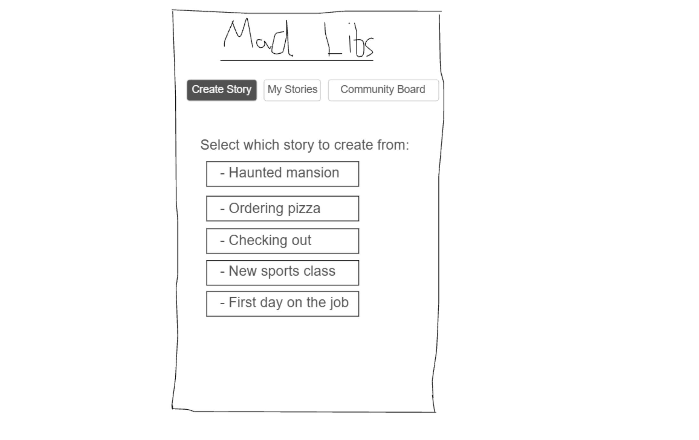
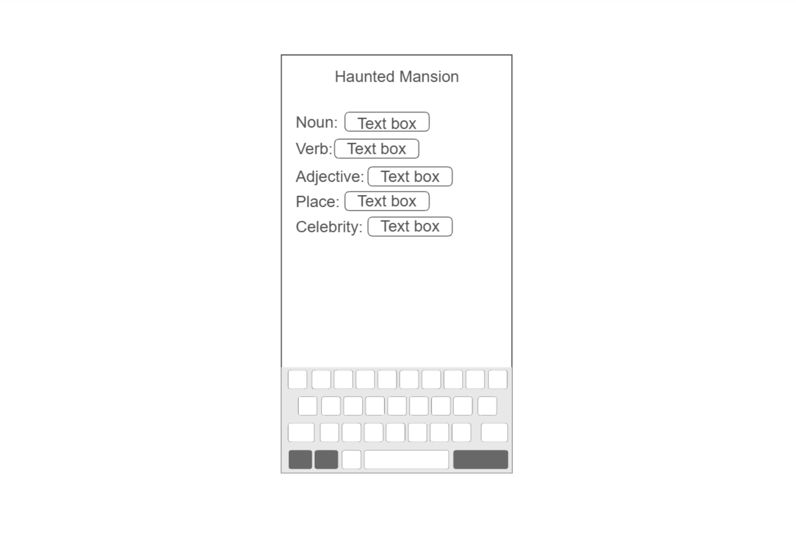
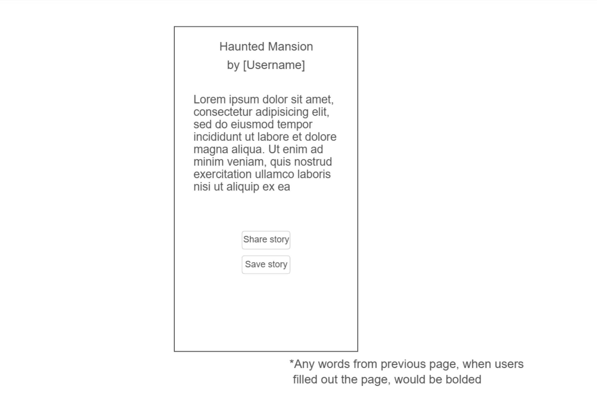
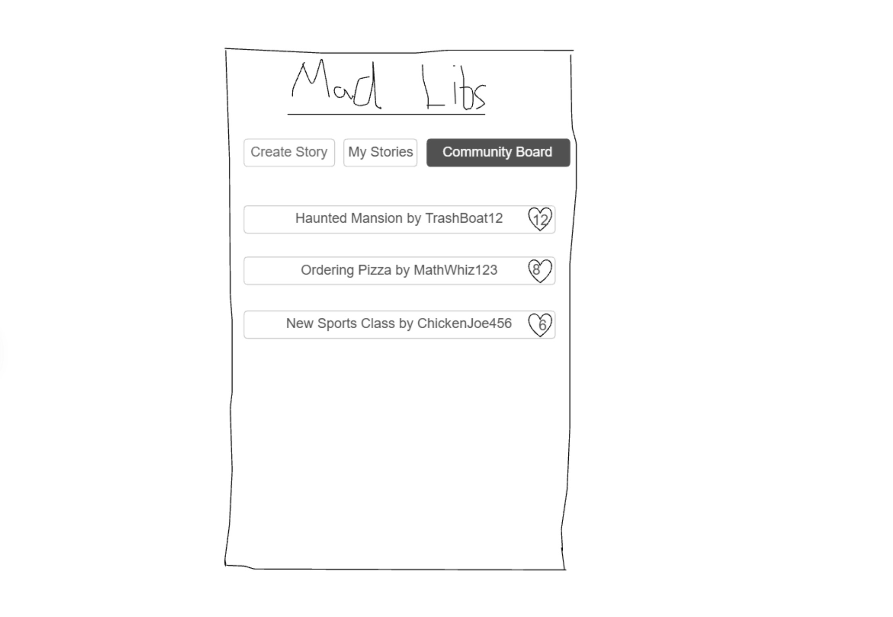
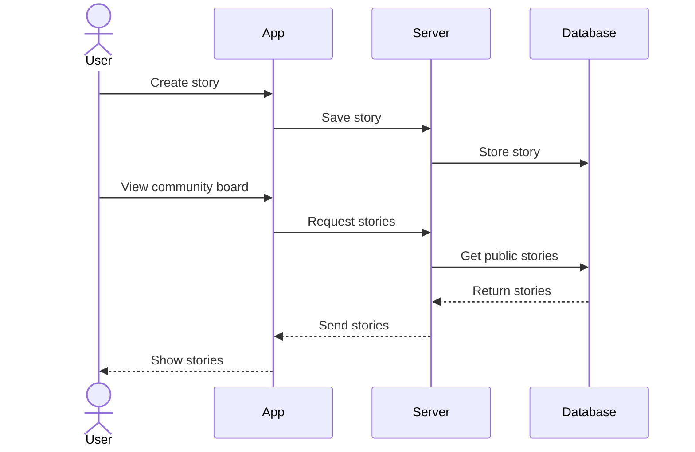

# Mad Libs

[My Notes](notes.md)

A startup application that provides entertainment for users with pre-written stories to create Mad Libs for. Users can also share their favorite Mad Libs to a community board that all users can see and enjoy in laughter.

> [!NOTE]
>  This is a template for your startup application. You must modify this `README.md` file for each phase of your development. You only need to fill in the section for each deliverable when that deliverable is submitted in Canvas. Without completing the section for a deliverable, the TA will not know what to look for when grading your submission. Feel free to add additional information to each deliverable description, but make sure you at least have the list of rubric items and a description of what you did for each item.

> [!NOTE]
>  If you are not familiar with Markdown then you should review the [documentation](https://docs.github.com/en/get-started/writing-on-github/getting-started-with-writing-and-formatting-on-github/basic-writing-and-formatting-syntax) before continuing.

## 🚀 Specification Deliverable

### Elevator pitch

Imagine a fun, interactive, community-based version of Mad Libs! From pre-written stories, users can fill in the blanks to create their own wacky versions of these stories and post them to a community board for others to see. Be as crazy and funny as you can be!

### Design

\
\
\

How the backend works for creating, saving, and seeing stories.

### Key features

- Secure login via HTTPS
- Select pre-determined stories to create from
- Input of nouns, adjectives, etc., for each selected story
- Display of newly created story
- Options to privately save story and publicy share story to a community board
- Tabs/Pages for creating stories, seeing your saved stories (both private and public), and seeing community board (public) stories
- Ability to like community board stories. Stories are ranked on said page from most likes to lowest.

### Technologies
- **HTML** - Multiple pages for the app. A login/register page first appears, which takes to you the main landing page. Automatically open to a "Create Story" page, with tabs to choose seeing saved stories, and another for seeing community board stories.
    - Create story page takes you to other pages in the process of creating a Mad Lib.
- **CSS** - Visually pleasing styling with good fonts, color choices, and whitespace.
- **React** - Provides login capabilities, selection of stories, text input of words, as well as buttons to share and save stories.
- **Service** - Endpoints for login, submitting stories, and retrieving stories.
- **DB/Login** - Stores login info, stories that are selected to be saved, whether they are private or public, and which pages they should appear on depending on visibility. Also stores the structure for each pre-written story.
- **WebSocket** - Community board page lists all publicly shared stories across all users of the app. Gathers all stories at the time the "Community Board" button is selected.

## 🚀 AWS deliverable

AWS website: https://startup.madlibs.click
Simon sub-domain: https://simon.madlibs.click

## 🚀 HTML deliverable

For this deliverable I did the following. I checked the box `[x]` and added a description for things I completed.

**HTML pages** - Added HTML pages for each button of the application, as well as any additional pages when navigating through a certain page--notably the Create Story page  
**Proper HTML element usage** - Added headers, section dividers, and footers for each page.  
**Links** - Added link to my Github repository at the bottom of each page. Used the "onclick" HTML feature to navigate from one page to another when clicking on a button.  
**Text** - Included text on each page to communicate the purpose of each page and what the user can do with it.  
**3rd party API placeholder** - 3rd party API implementation will take place on the main createstory.html page that will serve as a random quote generator.  
**Images** - Added image to the main page of the application (createstory.html)  
**Login placeholder** - index.html includes text fields to insert a username and password, as well as "login" and "create" buttons.  
**DB data placeholder** - Placeholder data represented under the "My Stories" tab. Page will populate with all of the user's stories from the database.  
**WebSocket placeholder** - Live-update functionality enabled for "communityboard.html". Once a user saves their story, it will be updated under the community board page"

## 🚀 CSS deliverable

For this deliverable I did the following. I checked the box `[x]` and added a description for things I completed.

**Header, footer, and main content body** - styled header, footer, and main content bodies different from one another. There's a universal background, but differing colors between sections to contrast them.  
**Navigation elements** - page navigation at the top of each page navigates to the correct page, along with buttons navigating to the next pages/steps for selecting, writing, and reading a story. Stories under "my stories" and "community board" also navigate to a page to read the story.  
**Responsive to window resizing** - Elements still on display when zooming in or out of the page  
**Application elements** - Elements of the application are mostly buttons, leading you to differnet pages/parts the application. Text fields are also present for login as well as writing the necessary words for the story. Checkboxes are also found on story.html to allow for visibility on community board page and favorites section of my stories.  
**Application text content** - Varying styles and font sizes for application text content. Underline and bolded page titles contrast from the simple text found below. Italicized text is also present for a few various elements.
**Application images** - Created border around image element  

## 🚀 React part 1: Routing deliverable

For this deliverable I did the following. I checked the box `[x]` and added a description for things I completed.

**Bundled using Vite** - Used vite to bundle the project, porting all old html and css files to a new format via jsx files.  
**Components** - Slightly modified and updated css to conform to each page serving as a path for a BrowserRouter  
**Router** - All html were converted to jsx files. Each page served as a route path on my app.jsx file.  

## 🚀 React part 2: Reactivity deliverable

For this deliverable I did the following. I checked the box `[x]` and added a description for things I completed.

- [ ] **All functionality implemented or mocked out** - I did not complete this part of the deliverable.
- [ ] **Hooks** - I did not complete this part of the deliverable.

## 🚀 Service deliverable

For this deliverable I did the following. I checked the box `[x]` and added a description for things I completed.

- [ ] **Node.js/Express HTTP service** - I did not complete this part of the deliverable.
- [ ] **Static middleware for frontend** - I did not complete this part of the deliverable.
- [ ] **Calls to third party endpoints** - I did not complete this part of the deliverable.
- [ ] **Backend service endpoints** - I did not complete this part of the deliverable.
- [ ] **Frontend calls service endpoints** - I did not complete this part of the deliverable.
- [ ] **Supports registration, login, logout, and restricted endpoint** - I did not complete this part of the deliverable.

## 🚀 DB deliverable

For this deliverable I did the following. I checked the box `[x]` and added a description for things I completed.

- [ ] **Stores data in MongoDB** - I did not complete this part of the deliverable.
- [ ] **Stores credentials in MongoDB** - I did not complete this part of the deliverable.

## 🚀 WebSocket deliverable

For this deliverable I did the following. I checked the box `[x]` and added a description for things I completed.

- [ ] **Backend listens for WebSocket connection** - I did not complete this part of the deliverable.
- [ ] **Frontend makes WebSocket connection** - I did not complete this part of the deliverable.
- [ ] **Data sent over WebSocket connection** - I did not complete this part of the deliverable.
- [ ] **WebSocket data displayed** - I did not complete this part of the deliverable.
- [ ] **Application is fully functional** - I did not complete this part of the deliverable.
